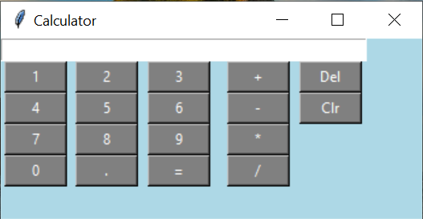

# Basic Calculator

This is a basic calculator that I made in a little less than a day. I've been studying interested in Python ever since I learned it in college back in 2015. I've been stdying on and off for a few years now, and while I've learned a lot, but haven't posted anything on GitHub or anything. Thought I would start with some small projects and see how things go. Here's a screenshot of the calculator I made with tkinter.

Running the run_calc.py file runs the program.

Would love any feedback that you have.

Thanks!
